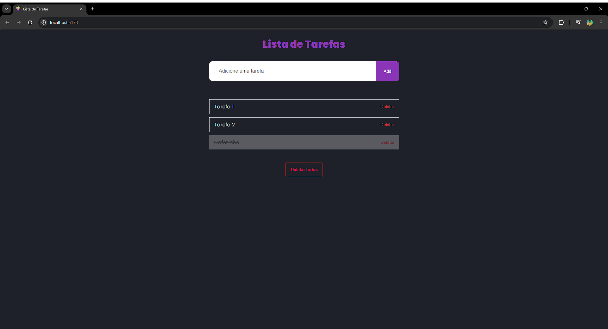

# React + Vite
 Primeiro projeto utilizando React, entendo suas funcionalidades. Projeto consiste numa lista de tarefas que o usuario tem varias funcionalidades, como por exemplo: adicionar uma tarefa nova, marcar como concluida, excluir apenas uma tarefa e excluir todas. Informacoes ficam salvas dentro da memoria local do navegador, caso usuario recarregue a pagina, os dados nela nao serao perdidos. 

 
 

